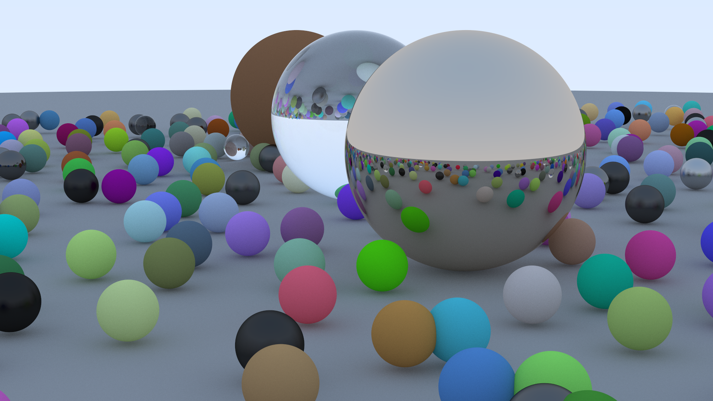

# Raytracing in One Weekend

My implementation of [Raytracing in One Weekend](https://raytracing.github.io/books/RayTracingInOneWeekend.html) using the Odin programming language.

## Usage

Requires Odin compiler (tested on version dev-2025-01:223970671). Run:
```sh
./build.sh
```
This will produce the executable `build/raytracer`, run it to get the output image as `output.ppm`(takes a long time, since it is CPU rendered). To render it in a lower amount of time for development, try reducing the IMAGE_WIDTH in `src/main.odin` or camera.samples_per_pixel and camera.max_depth in the camera_init procedure in `src/raytracer/camera.odin`.

## Final rendering

Took 2h35m on an AMD Ryzen 7600. Resolution=1920x1080, Max recursion depth = 100, Samples per pixel = 500, No defocus blur.


